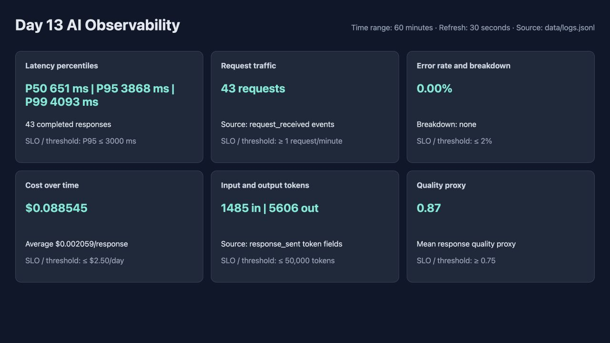

# Dashboard contract evidence

The verification command completed with the following result:

```text
HỢP LỆ: 6/6 panel có trong dashboard contract.
```

The six required operational panels are configured in [`config/dashboard.yaml`](../../config/dashboard.yaml): traffic, P50/P95/P99 latency, error rate, quality proxy, token usage, and cost.
The latency panel uses the contract threshold P95 `<= 3000 ms`.


