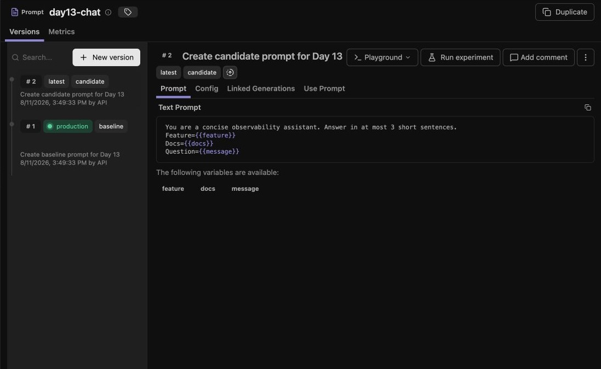

# Prompt label rollout and rollback evidence

Prompt `day13-chat` has two tested versions.

| Step | Production lookup result | Evidence |
|---|---|---|
| Baseline | v1 with labels `baseline`, `production` | Trace `79648482039602a16d3b7c1e5bf5dc85` has metadata `day13-chat`, `baseline`, v1. |
| Candidate | v2 with label `candidate` | Trace `4083645850d1f178409cca4b9ec6d301` has metadata `day13-chat`, `candidate`, v2. |
| Shift | `production_after_shift=v2` | Langfuse API lookup after assigning `production` to v2. |
| Rollback | `production_after_rollback=v1` | Langfuse API lookup after restoring `production` to v1. |

